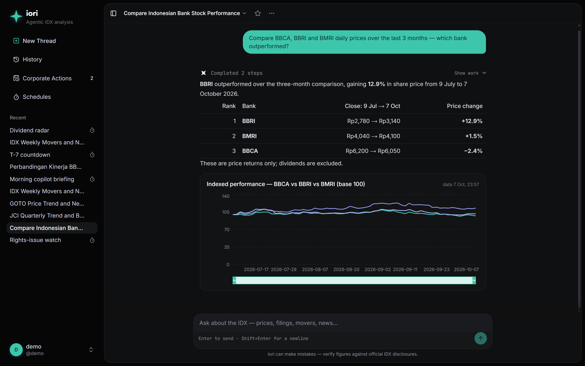
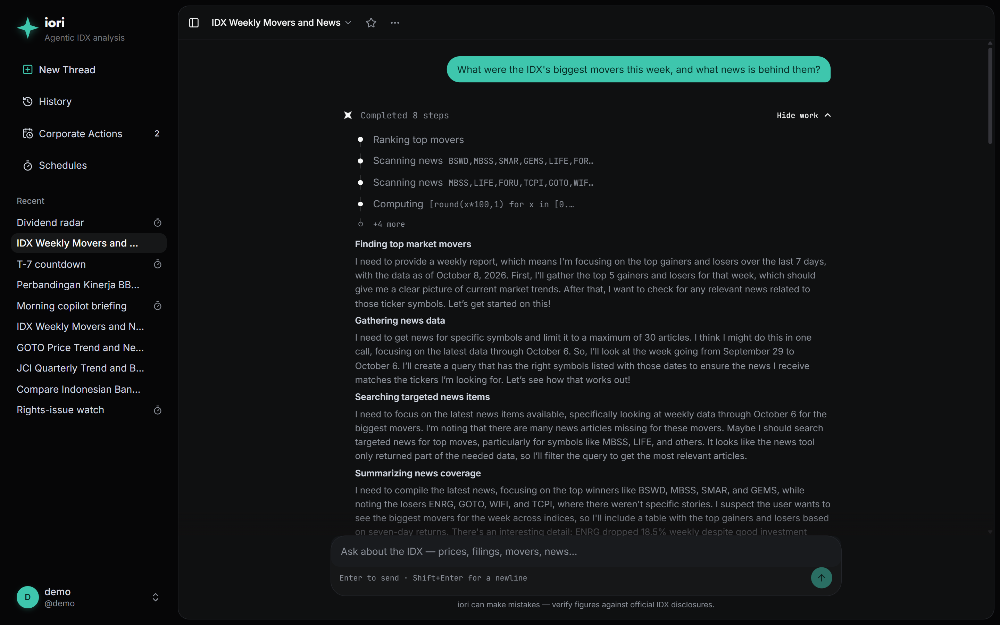
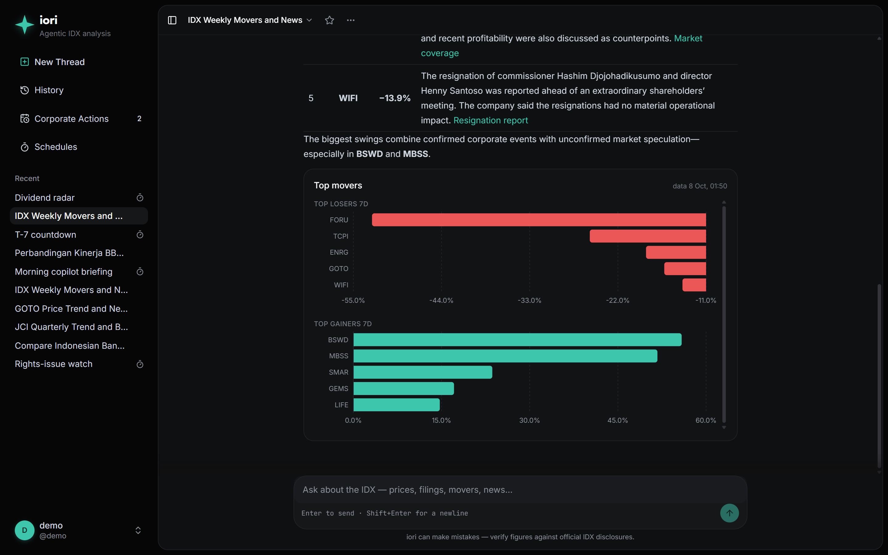
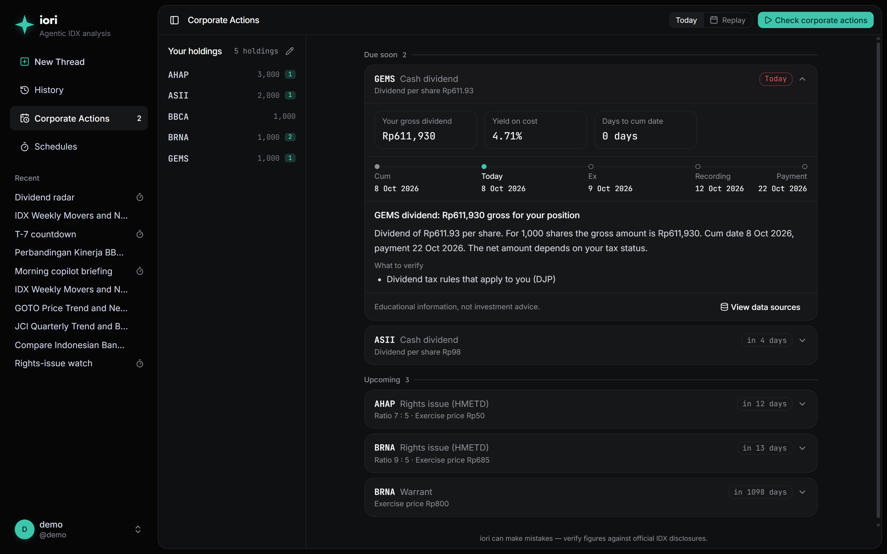
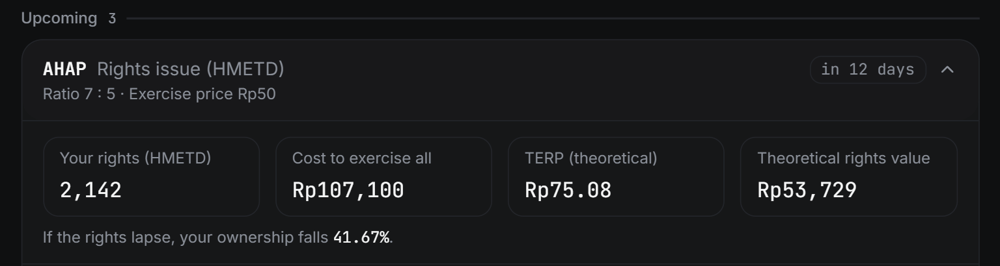
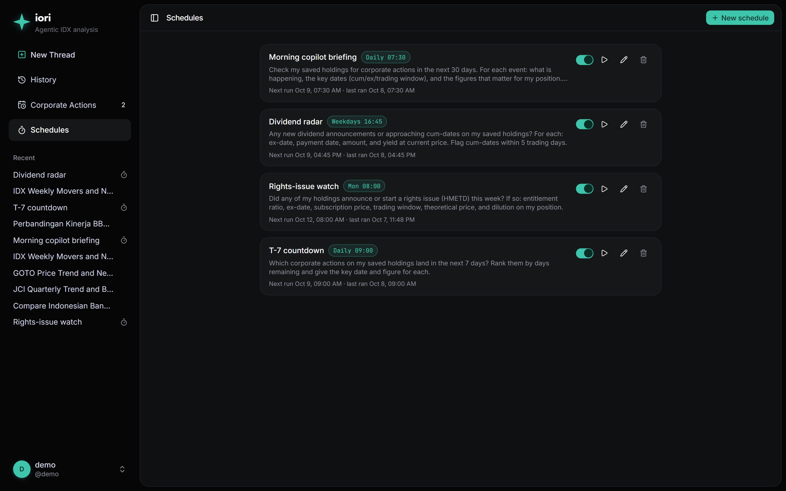
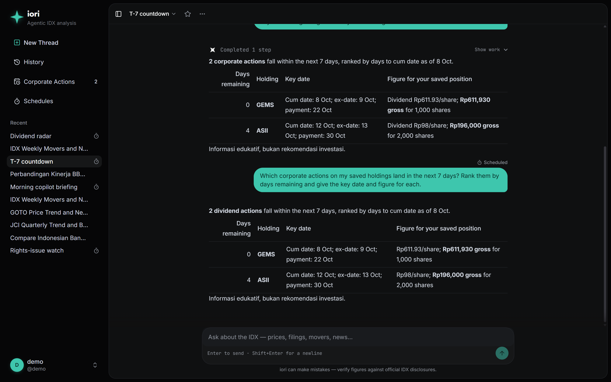
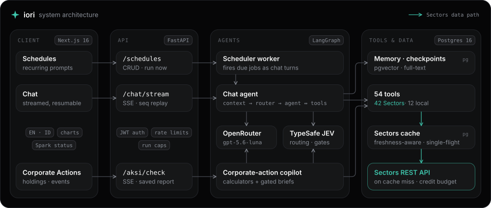
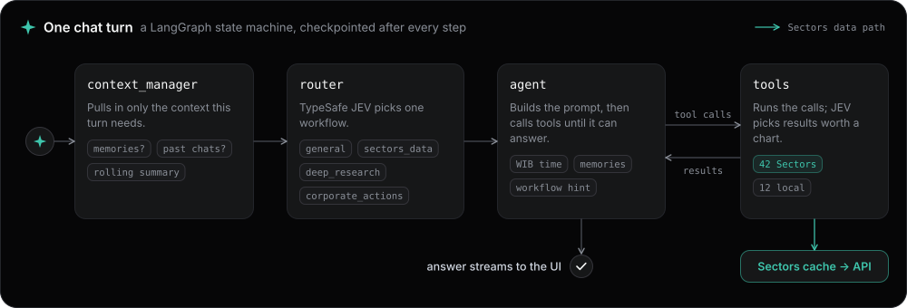

<div align="center">


# iori

**An AI analyst for the Indonesian stock market, built on live data from [Sectors](https://sectors.app).**

Ask anything about the IDX and watch it work. See what every dividend, rights issue and warrant means for *your* holdings. Then put the whole routine on a schedule.

### [→ Open the live app: iori.joven.dev](https://iori.joven.dev)

[▶ 1-minute teaser](TEASER_URL) · [▶ 3-minute walkthrough](WALKTHROUGH_URL) · [How it uses Sectors](#how-iori-uses-sectors) · [Run it locally](#run-it-locally)

     

*Sectors Hackathon Indonesia 2026 · Track 01: AI Agents & Assistants · Team Kata Mama Ikut Aja*

</div>

> [!TIP]
> **Try it in 30 seconds:** open **[iori.joven.dev](https://iori.joven.dev)** and sign in with
> **username `demo` · password `demo123`** to explore a ready-made workspace with saved holdings, running schedules and past research.
>
> The demo account is shared by everyone, so if you want to experiment, **create your own account** (*"No account? Create one"* on the sign-in page). It takes ten seconds and gives you a private workspace.



---

## The problem

It's 4 p.m. and the market has closed. Two of your stocks are red, and you want to know why. You open the news, then another site, then the IDX disclosures, and find a rights issue on a stock you own. How many rights do you get? How much cash do you need to take them up? How diluted are you if you skip it? When is the deadline? Out comes the calculator.

Tomorrow, you do it all again.

That's the daily routine for millions of Indonesian retail investors. They have no analyst, just a broker app, a dozen tabs and a spreadsheet. The data exists, but turning it into an answer about *their* position is manual, slow and easy to get wrong.

**Problem statement:** *Indonesian retail investors spend hours every day stitching together prices, news, IDX disclosures and corporate-action math across scattered sources. iori is an AI agent that answers their market questions from live Sectors data, works out exactly what each corporate action means for their own holdings, and runs that routine for them on a schedule.*

## What iori does

### 1 · Ask anything, and see the work

Ask about any IDX stock, sector, index, broker or miner, in English or Bahasa Indonesia. iori works out what data it needs, pulls it from Sectors, and streams the answer while you watch every step: which tool it called, with what arguments, and what it was thinking.

- **Answers you can check:** tables, auto-generated charts, linked news sources, and a data timestamp on every chart.
- **Honest about gaps:** when the data isn't there, iori says so instead of guessing.
- **Multi-step research:** comparisons, benchmark-relative performance, quarterly financials, foreign flow, broker activity and ownership, gathered and synthesised in one turn.
- **Runs in the background:** close the tab mid-answer and the run keeps going. Come back and it replays exactly where you left off.

<table>
<tr>
<td width="50%"></td>
<td width="50%"></td>
</tr>
<tr>
<td align="center"><sub><b>Every step is visible.</b> Tool calls, arguments and the reasoning summary.</sub></td>
<td align="center"><sub><b>Sourced answers.</b> News links per mover, plus a chart built from the tool data.</sub></td>
</tr>
</table>

### 2 · Make it yours: your holdings, your numbers

Tell iori what you hold, in chat (*"I own 3,000 AHAP"*) or in the holdings editor. It checks every position against the Sectors corporate-action calendar (cash dividends, rights issues/HMETD, warrants) and works out what each one means **for your share count**:

- **Dividends:** your gross amount, yield on cost, days to the cum date, and the full cum → ex → recording → payment timeline.
- **Rights issues:** your entitlement, cost to exercise all of it, theoretical ex-rights price (TERP), theoretical rights value, dilution if the rights lapse, and three side-by-side scenarios (exercise, sell, let lapse).
- **Context with sources:** insider filings, latest close vs. exercise price, and foreign-ownership trend, each tagged with the Sectors dataset and date it came from.
- **Replay:** run the check *as of* a past date. Every data window is clamped to that day, so it never peeks ahead.

**Every number is calculated, not generated.** Figures come from plain Python calculators. The language model only writes the sentences around them, and a gate rejects any brief that slips in its own digits or advice-style wording.

<p align="center">
<br/>
<sub><b>Corporate Actions.</b> 1,000 GEMS shares → Rp611,930 gross dividend, paid 22 Oct.</sub>
</p>

<p align="center">
<br/>
<sub><b>Rights issue math.</b> 3,000 AHAP → 2,142 rights, Rp107,100 to take them all up, 41.67% dilution if they lapse.</sub>
</p>

iori also **remembers you**. Preferences and facts from earlier chats are saved and pulled back in only when a question needs them. You can see and delete every memory in *Settings → Memory*.

### 3 · Put it on autopilot

If you can ask it, you can schedule it. Turn any prompt into a recurring job (daily, IDX trading days, weekly or monthly, in WIB), either on the Schedules page or just by asking: *"every weekday at 16:45, check my holdings for new dividend announcements."* The agent creates, edits and deletes its own jobs.

Each job runs as a full agent turn in its own thread, with the same tools, data and memory as a live chat. New output gets an unread dot in the sidebar, so tomorrow's routine is already done when you open the app.

<table>
<tr>
<td width="50%"></td>
<td width="50%"></td>
</tr>
<tr>
<td align="center"><sub><b>Schedules.</b> Morning briefing, dividend radar, rights-issue watch, T-7 countdown.</sub></td>
<td align="center"><sub><b>A scheduled run.</b> Upcoming actions on your holdings, ranked by days left.</sub></td>
</tr>
</table>

## Try it

1. Open **[iori.joven.dev](https://iori.joven.dev)**.
2. **Create an account** (username + password of at least 8 characters), or sign in with `demo` / `demo123` to browse the shared showcase.
3. Ask something. A few prompts to start with:

| Try asking | What you'll see |
|---|---|
| *Compare BBCA, BBRI and BMRI daily prices over the last 3 months. Which bank outperformed?* | Ranked table + indexed performance chart |
| *What were the IDX's biggest movers this week, and what news is behind them?* | Top gainers/losers chart, with the news linked per stock |
| *Bandingkan kinerja BBCA, BBRI, dan BMRI bulan ini* | Returns vs. IHSG, foreign flow and earnings, from one question in Bahasa |
| *I hold 3,000 AHAP and 1,000 GEMS. Any corporate actions coming up?* | Holdings saved, then per-event figures for your position |
| *Every weekday at 16:45, check my holdings for new dividend announcements* | A new schedule that runs on its own thread |

Then open **Corporate Actions** in the sidebar, add your holdings and press **Check corporate actions** to watch the copilot run end to end. *Settings → General → Language* switches both the interface and the replies between English and Bahasa Indonesia.

## Use cases

| Who | Situation | What iori does |
|---|---|---|
| **Retail investor** | A rights-issue notice lands on a stock they own | One card: entitlement, cash needed, dilution if skipped, the trading window and deadline, plus three scenarios |
| **Dividend collector** | Doesn't want to miss a cum date | A *Dividend radar* schedule on trading days that flags cum dates within 5 sessions, with yield at the current price |
| **Busy professional** | No time to check the market before work | A 07:30 *Morning briefing* that is already waiting in its own thread |
| **Stock picker** | Comparing names in the same sector | A multi-ticker comparison with benchmark-relative returns, foreign flow and earnings in one answer |
| **Market watcher** | Wants to know *why* something moved | Weekly movers with the news behind each move, plus a clear note when no story explains it |
| **New investor** | Learning what HMETD, cum date or TERP means | Plain explanations in Bahasa or English, tied to real numbers from their own holdings |

## How iori uses Sectors

Sectors isn't decoration here; it's the agent's entire view of the market. Every market fact in a chat answer, every corporate-action figure and every scheduled briefing comes from the Sectors REST API.

- **42 Sectors endpoints wrapped as agent tools.** That's 35 IDX tools (screener, company and subsector reports, daily prices, index data, quarterly financials, foreign flow, broker summary and activity, insider filings, shareholders, segments, corporate actions, suspensions, listing performance, news, taxonomy lists) plus 7 mining tools (companies, operations, annual production, sites, exports, commodity and global commodity prices). The agent combines them freely: a single research turn routinely chains 5–10 calls.
- **The corporate-action copilot is built on Sectors data end to end.** It reads the corporate-action calendar, then daily prices, shareholder composition and insider filings for context, feeding deterministic calculators.
- **Credit-aware by design.** Sectors credits are scarce, so the integration treats them as a budget:
  - A **permanent Postgres cache** with market-aware freshness. Entries go stale at the next weekday 17:00 WIB refresh (IDX publishes after the close), historical windows stay fresh forever, news refreshes every 30 minutes, and reference lists last 7 days. The agent sees `stale`, `fetched_at` and the current WIB time on every result and decides whether a refresh is worth it.
  - **Single-flight requests** (concurrent identical calls share one upstream request), **stale-if-error** (a failed refresh serves the stored copy rather than breaking the turn) and **404 caching** (a miss still costs a credit, so it's only paid once).
  - **Cheap defaults in code:** tickers are validated before any paid call, reports request one section rather than eight, and the structured screener is preferred over the 3-credit natural-language query.
  - A **global credit budget** (1,000) with atomic reservations and automatic refunds on non-billable responses (400/401/403/429/5xx), so concurrent users can never overspend.
- **On the live deployment (8 Oct 2026):** 136 cached responses, 197 credits spent, **112 credits saved by cache hits**. That's 36% of all billable lookups served for free.

<details>
<summary><b>All 42 Sectors tools: endpoints and credit costs</b></summary>

| Tool | Endpoint | Credits |
|---|---|---|
| `sectors_screen` | `GET /v2/companies/` | 1 structured / 3 NL |
| `sectors_company_report` | `GET /v2/company/report/{symbol}/` | 1/section |
| `sectors_subsector_report` | `GET /v2/subsector/report/{slug}/` | 1/section |
| `sectors_quarterly_financials` | `GET /v2/financials/quarterly/{symbol}/` | 1/quarter |
| `sectors_quarterly_dates` | `GET /v2/company/get_quarterly_financial_dates/{symbol}/` | 1 |
| `sectors_daily_prices` | `GET /v2/daily/{symbol}/` | 1/symbol |
| `sectors_idx_market_summary` | `GET /v2/idx-total/` | 1 |
| `sectors_market_close` | `GET /v2/close/` | 1 |
| `sectors_index_daily` | `GET /v2/index-daily/{code}/` | 1 |
| `sectors_index_universe` | `GET /v2/index-daily/` | 1 |
| `sectors_most_traded` | `GET /v2/most-traded/` | 2 |
| `sectors_top_movers` | `GET /v2/companies/top-changes/` | 1/class×period |
| `sectors_foreign_flow` | `GET /v2/foreign-flow/{symbol}/` | 1/symbol |
| `sectors_foreign_flow_universe` | `GET /v2/foreign-flow/` | 1 |
| `sectors_free_float` | `GET /v2/free-float/` | 1 |
| `sectors_news` | `GET /v2/news/` | 1 |
| `sectors_broker_summary` | `GET /v2/broker-summary/{symbol}/` | 1 |
| `sectors_broker_top` | `GET /v2/broker-summary/{symbol}/top/` | 2 |
| `sectors_broker_registry` | `GET /v2/brokers/` | 1 |
| `sectors_broker_activity` | `GET /v2/broker-activity/{code}/` | 1 |
| `sectors_broker_activity_top` | `GET /v2/broker-activity/{code}/top/` | 2 |
| `sectors_top_brokers` | `GET /v2/brokers/top/` | 2 |
| `sectors_insider_filings` | `GET /v2/filings/` | 1 |
| `sectors_suspensions` | `GET /v2/suspensions/` | 1 |
| `sectors_corporate_actions` | `GET /v2/corporate-actions/` | 1/type |
| `sectors_company_corporate_actions` | `GET /v2/company/corporate-actions/{symbol}/` | 1 |
| `sectors_listing_performance` | `GET /v2/listing-performance/{symbol}/` | 1 |
| `sectors_shareholders` | `GET /v2/company/shareholders-composition/{symbol}/` | 1 |
| `sectors_company_segments` | `GET /v2/company/get-segments/{symbol}/` | 1 |
| `sectors_companies_with_segments` | `GET /v2/companies/list_companies_with_segments/` | 1 |
| `sectors_list_subsectors` | `GET /v2/subsectors/` | 1 |
| `sectors_list_industries` | `GET /v2/industries/` | 1 |
| `sectors_list_subindustries` | `GET /v2/subindustries/` | 1 |
| `sectors_list_tags` | `GET /v2/tags/` | 1 |
| `sectors_compare` | `GET /v2/company/report/{symbol}/` (multi) | 1/section/symbol |
| `sectors_mining_companies` | `GET /v2/mining/companies/` | 1 |
| `sectors_mining_company_detail` | `GET /v2/mining/companies/{slug}/` | 1 |
| `sectors_mining_company_performance` | `GET /v2/mining/companies/performance/{slug}/` | 1 |
| `sectors_commodity_prices` | `GET /v2/mining/commodities/{name}/price/` | 1 |
| `sectors_mining_sites` | `GET /v2/mining/sites/` | 1 |
| `sectors_mining_exports` | `GET /v2/mining/exports/` | 1 |
| `sectors_global_commodity` | `GET /v2/mining/global-commodity/` | 1 |

The agent also has 12 local tools that sit on top of the cache: `compute` (a safe calculator, so the model never does arithmetic in its head), `aksi_impact` / `aksi_check` / `aksi_report` / `aksi_reports` (corporate-action figures and runs), `holdings_list` / `holdings_save` / `holdings_remove`, and `schedule_list` / `schedule_create` / `schedule_update` / `schedule_delete`. That makes **54 tools** in total.

Billing reference (docs.sectors.app): 2xx and 404 consume credits; 400/401/403/429/5xx are free. Per-section reports and per-classification rankings bill per part.

</details>

## Architecture

<p align="center"></p>

Every chat turn runs one graph:

<p align="center"></p>

- **context_manager** asks TypeSafe JEV two yes/no questions in one call: does this turn need the user's memories, and does it need past chats? Small talk never pays for retrieval. Long threads get a rolling chained summary; history is never trimmed.
- **router** sends each question to one of four workflows (`general`, `sectors_data`, `deep_research`, `corporate_actions`), each with its own instructions. If JEV is unavailable it falls back to `general`, so a classifier outage never breaks a turn.
- **agent** composes the system prompt per turn from the current WIB time, the workflow hint, the summary, recalled memories and related threads, then calls tools until the answer is complete.
- **tools** runs the calls, then JEV decides which results deserve a chart, and the chart spec is extracted from the raw tool data rather than from the model's text.

### Technical deep dive

<details>
<summary><b>Corporate-action copilot (Aksi Korporasi)</b></summary>

A dedicated LangGraph (`backend/app/aksi/`) checks saved holdings against the corporate-action calendar and streams progress over SSE into a persisted, replayable report.

```
scan → load_pack → calculate → investigate → brief → finish   (brief loops back to load_pack per event)
```

- **calculate:** pure functions in `calc.py` compute every figure (entitlement, exercise cost, TERP, rights value, dilution, gross dividend, yield on cost, days to dates).
- **investigate:** the LLM may only gather cached context (filings, prices, shareholders) and write findings that cite their source.
- **brief:** the LLM writes the bilingual summary using `{{placeholders}}` for numbers. A deterministic check plus a JEV gate reject any draft containing its own digits or advice language, falling back to a template.
- **Replay (`as_of`):** clamps every tool window to the analysis date, so historical runs never see the future.
- A per-run credit budget and endpoint rate limits keep a check from draining the shared Sectors allowance.

</details>

<details>
<summary><b>Long-term memory and cross-thread recall</b></summary>

After each turn, a background task extracts first-person facts (*"User holds BBRI"*, *"User prefers Bahasa"*), sanitises them and deduplicates them by hash. JEV then classifies each new fact against existing ones as `restates` / `refines` / `contradicts` / `unrelated`, which maps to no-op / update + merge / delete + add / add. Each user has a capped memory set.

On recall, JEV scores every stored memory against the question directly, so a memory phrased nothing like the query is still found. When no judge is available, the classic pipeline takes over: HyDE-style query normalisation, then pgvector cosine + Postgres `ts_rank`, then reciprocal rank fusion (k=60), then rerank.

Debounced per-thread digests power cross-thread recall ("like we discussed last week…").

</details>

<details>
<summary><b>Resumable streaming runs</b></summary>

Generation runs in detached producers keyed by thread, so a run survives the browser disconnecting. Each run keeps a sequence-numbered replay buffer. `GET /threads/{id}/stream?last_seq=N` replays missed events, and the frontend rebuilds the thinking panel, steps and timer from it. `POST /threads/{id}/stop` cancels gracefully and checkpoints the partial answer. Global and per-user run caps apply, and finished runs linger briefly for replay before eviction.

Checkpoints use LangGraph's `AsyncPostgresSaver` on a psycopg pool (the pool must exceed `STREAM_MAX_ACTIVE_RUNS`, which is enforced at startup).

</details>

<details>
<summary><b>Scheduled jobs</b></summary>

`backend/app/schedules/` holds pure WIB slot math (`due.py`), persistence and the agent's `schedule_*` tools. A worker loop fires due jobs as ordinary `run_turn` calls on the job's own thread, so streaming, replay, checkpointing and memory all work unchanged. The slot is stamped *before* firing, which means a failed run never retries in a loop. Missed slots (for example, while the server was down) are caught up on the next tick, and a job never interleaves with a conversation the user is having on that thread.

</details>

<details>
<summary><b>Graceful degradation</b></summary>

Every `jev_ask` returns `None` on a missing key or failure, and each call site falls back to LLM structured output or a deterministic default. Without a Sectors key, the tools report "not configured" instead of crashing. When the credit budget is exhausted, cached data is still served, flagged as such.

</details>

## Tech stack

| Layer | Technology |
|---|---|
| **Frontend** | Next.js 16 (App Router) · React 19 · TypeScript · Tailwind CSS 4 · shadcn/ui (Radix) · Recharts · Zustand · react-markdown |
| **Backend** | Python 3.10 · FastAPI · LangGraph · SQLAlchemy (async, asyncpg) · psycopg pool · Alembic · slowapi · JWT (python-jose) |
| **AI** | OpenRouter (`openai/gpt-5.6-luna` for the agent, `text-embedding-3-small` for embeddings) · TypeSafe JEV for routing, gates, reranking and chart judgement |
| **Data** | Sectors REST API v2 · PostgreSQL 16 + pgvector |
| **Infra** | Docker Compose (dev and prod) · VPS behind a reverse proxy · same-origin `/api` proxy |

## Run it locally

**Prerequisites:** Docker Desktop and API keys for [Sectors](https://sectors.app), [OpenRouter](https://openrouter.ai) and, optionally, TypeSafe (without it, every JEV call site falls back to the LLM).

```bash
git clone https://github.com/JovenWu/iori.git && cd iori

cp backend/.env.example backend/.env    # fill SECRET_KEY, OPENROUTER_API_KEY, SECTORS_API_KEY,
                                        #   TYPESAFE_API_KEY (optional), APP_USERNAME/APP_PASSWORD
docker volume create backend_pgdata     # first run only (the compose volume is external)
docker compose up -d                    # Postgres :5433 · backend :8000 · frontend :3000
```

Open **http://localhost:3000**. The backend runs `alembic upgrade head` on start; interactive API docs are at http://localhost:8000/docs (hidden when `ENVIRONMENT=production`). After dependency changes, rebuild with `docker compose up -d --build`.

**Production:** `docker compose -f docker-compose.prod.yml up -d --build` builds baked images (no bind mounts, non-root users, Postgres unpublished). It requires `ENVIRONMENT=production`, a strong `SECRET_KEY` and a strong database password; the app refuses to start otherwise.

> **Windows note:** the backend forces `WindowsSelectorEventLoopPolicy`, because psycopg async can't run on the default Proactor loop.

## Testing

```bash
docker compose exec backend python -m pytest tests          # 273 tests on a dedicated sectors_agent_test DB
docker compose exec frontend npx tsc --noEmit && docker compose exec frontend npx eslint .
```

The tests mock the Sectors client, so running the suite never spends credits. Coverage spans the agent graph, router, context gates, memory pipeline, Sectors cache freshness and budget, corporate-action calculators and gate, scheduler slot math, and the auth, chat, Sectors, corporate-action and schedule APIs.

<details>
<summary><b>API reference</b></summary>

All routes are under `/api/v1`.

| Method | Path | Purpose |
|---|---|---|
| POST | `/auth/register` | create an account → access + refresh JWT |
| POST | `/auth/login` | sign in → access + refresh JWT |
| POST | `/auth/token` | OAuth2 password form (Swagger *Authorize*) |
| POST | `/auth/refresh` | rotate the token pair |
| POST | `/auth/logout` | bump `token_version`, revoking all tokens |
| GET | `/users/me` | current user |
| POST | `/chat/stream` | start a turn → SSE (`started` / `reasoning` / `token` / `tool` / `chart` / `done` / `stopped` / `error`, seq-numbered) |
| GET | `/threads` | list threads (keyset-paginated, starred first) |
| GET / PATCH / DELETE | `/threads/{id}` | thread detail with messages · rename/star · delete with checkpoints and digest |
| GET | `/threads/{id}/stream` | re-attach / replay (`?last_seq=N`) |
| POST | `/threads/{id}/stop` | graceful stop, partial answer kept |
| GET | `/memories` · `/memories/search?q=` | list memories · run the recall pipeline |
| DELETE | `/memories/{id}` | forget a memory |
| GET / POST | `/schedules` | list · create a scheduled job |
| PATCH / DELETE | `/schedules/{id}` | edit / pause · delete |
| POST | `/schedules/{id}/run` | run a job now |
| GET / PUT | `/aksi/holdings` | the user's holdings |
| POST | `/aksi/check` | run a corporate-action check → SSE (`step` / `tool` / `event_found` / `numbers` / `finding` / `brief` / `budget` / `done` …) |
| GET | `/aksi/check/stream` | re-attach / replay a check |
| POST | `/aksi/check/stop` | stop the active check (partial report kept) |
| GET | `/aksi/reports/latest` · `/aksi/reports/{id}` | latest (`?mode=live\|replay`) · one report |
| POST | `/aksi/impact` | one holding's corporate-action figures, no LLM |
| GET | `/sectors/cache/stats` | cache entries, hits, credits spent / saved / remaining |
| DELETE | `/sectors/cache` | flush the cache (only `ADMIN_USERNAME`; disabled when unset) |

SSE events are JSON `data:` lines shaped `{"seq": N, "type": "...", "data": ...}`. `tool` events carry `{name, status: "call" | "done" | "error"}` so clients can render tool progress.

</details>

<details>
<summary><b>Project layout</b></summary>

```
backend/app/
  agent/       graph, context (gates + summary), router (JEV), nodes, tools node, compute, runs, scheduler, service
  aksi/        corporate-action copilot: calc, events, findings, sources, briefs, gate, budget, graph, nodes, store
  memory/      embeddings, extractor, store, recall, pipeline, digests
  sectors/     client (httpx), freshness (WIB boundaries), cache, budget, tools (42), charts
  schedules/   due (slot math), store, tools
  api/v1/      endpoints: auth, users, chat, memory, sectors, aksi, schedules
  core/        config, security (JWT), llm factory, jev client, logging, middleware, rate limits
  models/  schemas/  prompts/  db/
backend/tests/ 273 tests, Sectors client mocked
frontend/
  app/(chat)/  chat, /threads/{id}, /history, /action (corporate actions), /schedules
  app/(auth)/  sign in / register
  components/  agent status (Spark), charts, aksi/*, schedules/*, sidebar, settings, memory
  lib/         API client + SSE, zustand stores, settings (theme, language), tool labels
```

</details>

## Guardrails

iori is an information and analysis tool. It explains what the data says and what an event means for a position. It never tells anyone to buy, sell, hold or exercise, and it never places or automates orders. Corporate-action figures come from deterministic calculators, every finding cites its Sectors source and date, and the interface shows exactly which data each answer was built from.

## Team

**Kata Mama Ikut Aja:** Joven · Anthony Irawan · Styven · Derrick

Built from 21 September to 8 October 2026 for **Sectors Hackathon Indonesia 2026** (Track 01: AI Agents & Assistants). The history is phase by phase, in about 80 commits.

Market data by [Sectors](https://sectors.app) · classification by TypeSafe JEV · models via [OpenRouter](https://openrouter.ai).

© 2026 Team Kata Mama Ikut Aja. All rights reserved.
